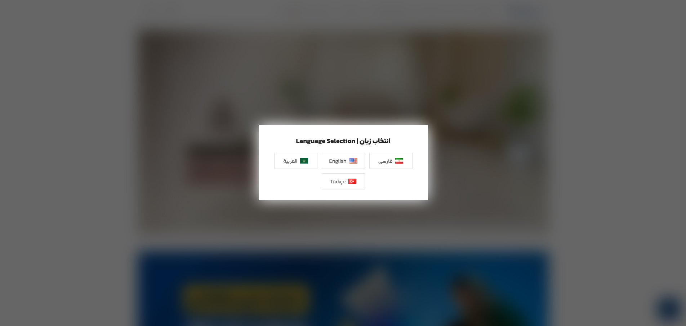

# mk-pll-lang-popup-simple

A lightweight and simple WordPress plugin for a language selection popup component.

## English

### What it is
A minimal WordPress plugin for showing a language switcher popup. Ideal for small projects or quick demos where a simple and clean language selection UI is needed.

### Features
- Simple popup interface
- Works with Polylang
- Minimal design

### Usage
1. Copy the plugin folder to `wp-content/plugins/`.
2. Activate the plugin in the WordPress admin plugins screen.
3. Install and activate the Polylang plugin if not already active.
4. Configure available languages in Polylang settings.
5. The popup is added automatically to the website's front page, so no further action is needed.

## فارسی

### معرفی
یک پلاگین ساده وردپرس برای نمایش پنجره انتخاب زبان. مناسب برای پروژه‌های کوچک یا نمونه‌های سریع که نیاز به رابط کاربری ساده برای تغییر زبان دارد.

### ویژگی‌ها
- رابط کاربری ساده
- هماهنگی با پلی‌لنگ
- طراحی سبک

### نحوه استفاده
1. پوشه پلاگین را به `wp-content/plugins/` منتقل کنید.
2. پلاگین را از صفحه مدیریت افزونه‌های وردپرس فعال کنید.
3. افزونه Polylang را نصب و فعال کنید اگر قبلاً فعال نشده است.
4. زبان‌های موجود را در تنظیمات Polylang پیکربندی کنید.
5. پنجره به طور خودکار به صفحه اصلی سایت اضافه می‌شود و نیازی به اقدام بیشتری نیست.